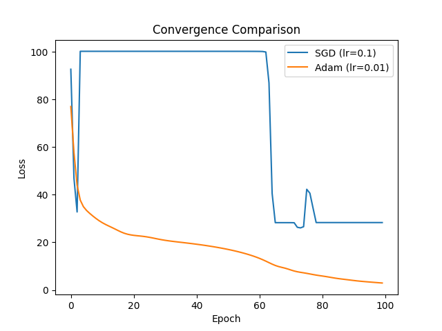
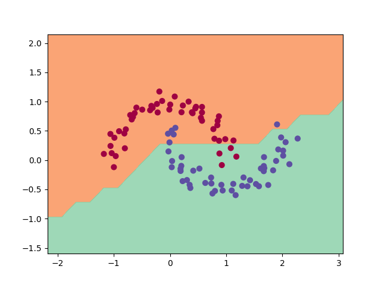

# micro-tensor


A lightweight, from-scratch tensor engine and deep learning library built with C-accelerated NumPy backends.

## Key Features
- **Vectorized Autograd:** Implements reverse-mode automatic differentiation over N-dimensional arrays.
- **Matrix Calculus:** Handles the Transpose Rule for gradient routing in linear layers.
- **Advanced Optimizers:** Includes standard SGD and the Adam optimizer with bias correction and momentum.
- **Broadcasting Support:** Custom un-broadcasting logic for element-wise operations.

## Performance Benchmarking
This engine was tested on the non-linear 'Make Moons' dataset. Below is a comparison of convergence between standard Stochastic Gradient Descent and the Adam optimizer.



### Learned Decision Boundary (Adam)


## Implementation Details
The backward pass for matrix multiplication ($Y = XW + b$) is calculated as:
- $\frac{\partial L}{\partial X} = \frac{\partial L}{\partial Y} W^T$
- $\frac{\partial L}{\partial W} = X^T \frac{\partial L}{\partial Y}$

## Installation
```bash
git clone [https://github.com/nibir-ai/micro-tensor.git](https://github.com/nibir-ai/micro-tensor.git)
pip install -r requirements.txt
