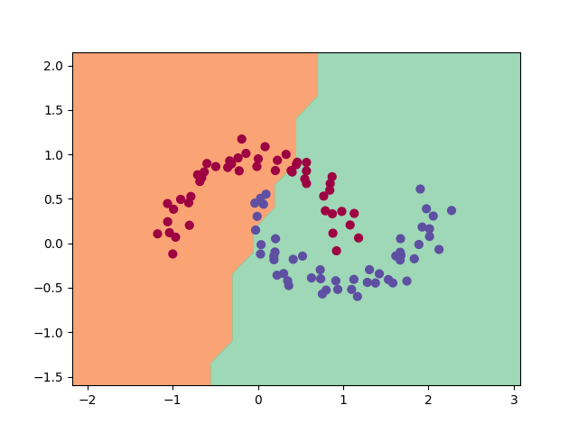

# micro-tensor


A lightweight, from-scratch tensor engine and deep learning library. 

## Key Features
- **Vectorized Backend:** Uses NumPy for C-accelerated matrix operations.
- **Dynamic DAG:** Builds the computational graph on the fly.
- **Auto-Broadcasting:** Handles gradient un-broadcasting for element-wise operations.
- **PyTorch-like API:** Familiar `Module`, `Linear`, and `MLP` abstractions.

## The Math Behind the Engine
Unlike scalar-based engines, `micro-tensor` operates on N-dimensional arrays. The backward pass for matrix multiplication ($Y = XW + b$) utilizes the Transpose Rule for gradient routing:
$$\frac{\partial L}{\partial X} = \frac{\partial L}{\partial Y} W^T$$
$$\frac{\partial L}{\partial W} = X^T \frac{\partial L}{\partial Y}$$

## Real-World Application: Make Moons
Below is the decision boundary generated by a 2-layer MLP (16 neurons each) built with `micro-tensor` training on a non-linear dataset:



## Usage
```python
from microtensor.nn_tensor import MLP
from microtensor.tensor import Tensor
from microtensor.optim_tensor import SGD

# 2 inputs, two hidden layers of 16, 1 output
model = MLP(2, [16, 16, 1])
optimizer = SGD(model.parameters(), lr=0.1)

# Forward, Backward, Step
y_pred = model(X_tensor)
loss = (y_pred - Y_target).sum()
optimizer.zero_grad()
loss.backward()
optimizer.step()
